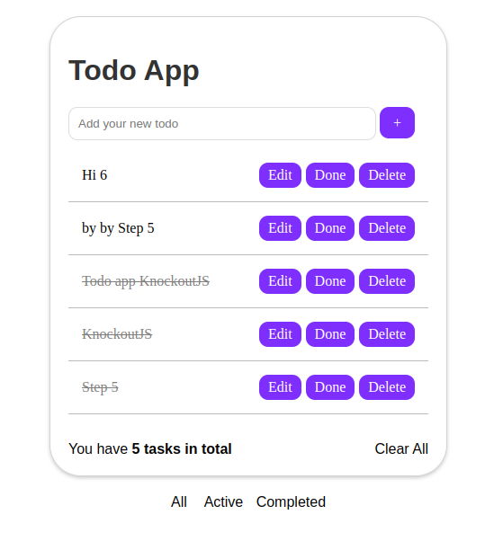
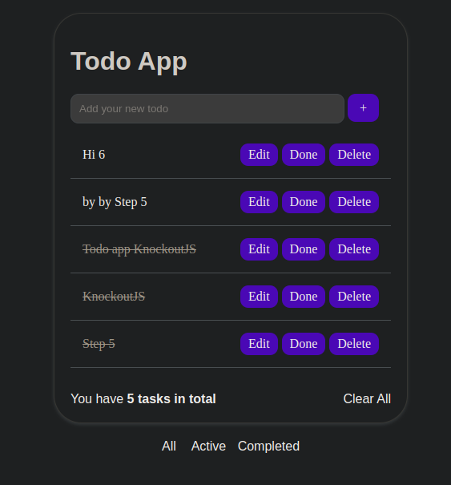

<h1>Todo-App-knockoutJS</h1>

    This is a professional Todo-App built using Knockout.js, providing a sleek
    and visually appealing interface. The application allows users to manage
    their tasks efficiently, offering various features such as adding, deleting,
    and editing entries, as well as categorizing tasks into three modes: active,
    complete, and all.

   
   

<h2>Features</h2>
<ul>
    <li>
        

            <strong>Add Task</strong>: Users can easily add new tasks to their
            to-do list. The intuitive interface enables quick entry of task
            details, ensuring a seamless user experience.
        

    </li>
    <li>
        

            <strong>Delete Task</strong>: Unwanted tasks can be easily removed
            from the list with a simple click. This feature helps users keep
            their to-do list organized and clutter-free.
        

    </li>
    <li>
        

            <strong>Edit Task</strong>: Users have the ability to edit the
            details of any task on the list. This feature allows for easy
            updates or modifications to task descriptions, due dates, or other
            relevant information.
        

    </li>
    <li>
        

            <strong>Categorization</strong>: Tasks can be categorized into three
            different modes: active, complete, and all. Users can easily switch
            between these modes to view specific subsets of tasks based on their
            completion status.
        

    </li>
</ul>
<h2>Installation</h2>

To use this Todo-App, follow the instructions below:

<ol>
    <li>
        
Clone the repository:

        <pre><code> https://github.com/your-username/todo-app.git
</code></pre>
    </li>
    <li>
Open the project folder in your preferred code editor.
</li>
    <li>
        

            Launch the application by opening the
            <code>index.html</code> file in a web browser.
        

    </li>
</ol>
<h2>Technologies Used</h2>

    The following technologies and libraries were used to develop this Todo-App:

<ul>
    <li>
        <strong>HTML</strong>: The standard markup language for creating the
        structure and elements of web pages.
    </li>
    <li>
        <strong>CSS</strong>: The style sheet language used for designing the
        visual presentation of web pages.
    </li>
    <li>
        <strong>JavaScript</strong>: The programming language that enables
        dynamic behavior and interactivity in web applications.
    </li>
    <li>
        <strong>Knockout.js</strong>: A powerful JavaScript library for building
        dynamic and responsive user interfaces. Knockout.js facilitates the
        creation of interactive web applications with a clean separation between
        data model and view components.
    </li>
</ul>
<h2>Usage</h2>
<ol>
    <li>
        

            Upon launching the application, you will be presented with a
            visually appealing interface.
        

    </li>
    <li>
        

            To add a new task, click on the "Add Task" button and enter the task
            details in the provided input fields. Press the "Enter" key or click
            the "Add" button to add the task to your list.
        

    </li>
    <li>
        

            To delete a task, click on the corresponding "Delete" button next to
            the task you wish to remove. Confirm the deletion if prompted.
        

    </li>
    <li>
        

            To edit a task, click on the task description or any other relevant
            field. Make the necessary changes and press the "Enter" key or click
            outside the field to save your edits.
        

    </li>
    <li>
        

            To switch between task categories, use the buttons or tabs provided.
            The "Active" mode displays only incomplete tasks, the "Complete"
            mode shows only completed tasks, and the "All" mode displays all
            tasks regardless of their completion status.
        

            </li>
</ol>
<h2>Contributing</h2>

    Contributions are welcome! If you would like to contribute to this project,
    please follow these steps:

<ol>
    <li>
Fork the repository.
</li>
    <li>
Create a new branch for your feature or bug fix.
</li>
    <li>
        

            Make your changes and commit them with descriptive commit messages.
        

    </li>
    <li>
Push your changes to your forked repository.
</li>
    <li>
        

            Submit a pull request, explaining the changes you have made and
            their purpose.
        

    </li>
</ol>

<h2>Contact</h2>

    If you have any questions, suggestions, or feedback regarding this project,
    please feel free to reach out:

    Thank you for using the Todo-App! We hope it helps you stay organized and
    efficient in managing your tasks.

